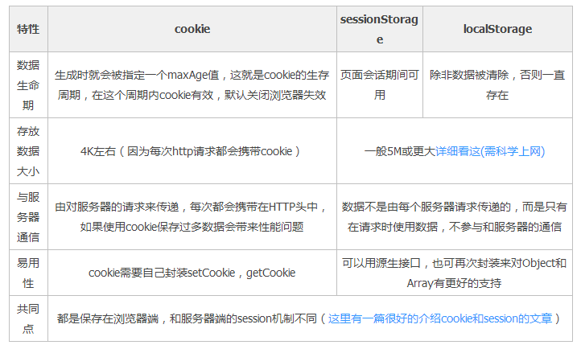

<p align="center"><strong>localStorage与sessionStorage</strong></p>
</br>

HTML中，新加入的 `loclStorage` 特性，主要是 `用来作为本地存储来使用` ,解决了 `cookie存储空间不足的问题(cookie中每条cookie的存储空间为4k)` ,localStorage一般浏览器支持的是5M，不同浏览器有所不同。
</br>

#### localStorage优势：
<ol>
    <li>拓展了cookie的4K限制</li></br>
    <li><strong>会将第一次请求的数据直接存储到本地</strong> ,相当于一个5M大小的针对于前端页面的数据库，相比于cookie可以节约带宽，但是只有IE8以上才支持。</li>
</ol>
</br>

#### localStorage局限：
<ol>
    <li>不同浏览器的容量不同，且在IE8以上的IE版本才支持</li></br>
    <li>基本所有的浏览器都会把localStorage的值类型限定为String类型，在与JSON对象的使用中需要转换</li></br>
    <li>在浏览器的隐私模式下为不可读取的</li></br>
    <li>本质上是对String的读取，存储过多会过度消耗内存空间，进而导致页面变卡</li></br>
    <li>不能被爬虫抓取到</li></br>
</ol>

#### localStorage的应用方式及场景


**<p>如果是IE浏览器的话，那么要用UserData来作为存储</p>**

##### 判断浏览器是否支持LocalStorage属性

```
        if (window.localStorage) {
            console.log("浏览器支持localStorage");
        } else {
            alert("浏览器版本低，不支持localStorage,请升级版本");
        }
```

##### localStorage属性的3种写入方法

```
        var storageData = window.localStorage;
        
        storageData["A"] = 1;
        
        storageData.B = 2;
        
        storageData.setItem("C", 3);
        
        console.log(typeof(storageData["a"]));

        console.log(typeof(storageData["b"]));

        console.log(typeof(storageData["c"]));

        console.log(typeof(storageData));

```
**存储进去的int类型，打印出来string类型，这与localStorage的特点有关，``localStorage只支持string类型的存储``**
<p>结果如下：</p>


##### localStorage属性的3种读取方法
**<p>官方推荐的是getItem()/setItem()来进行存取</p>**

```
        var storageData = window.localStorage;

        storageData.a = 'A';

        storageData.b = 'B';

        storageData.c = 'C';

        console.log(storageData['a']);

        console.log(storageData.b);

        console.log(storageData.getItem('c'));


```


---

#### localStorage , cookie , session 三者的不同：

&ensp;&ensp;&ensp;&ensp; **localStorage** ：`永久性存储` ，存于`浏览器端` ，属于webStorage的一个API。
</br>

&ensp;&ensp;&ensp;&ensp; **cookie** ：`临时会话`, 存于`浏览器端` ，只能以`文本的形式保存字符串类型`，`单个cookie保存的数据不能超过4kb。`。 `服务器发给客户端的特殊信息，每次请求时都带上它,安全性不如session`(cookie欺骗，cookie截获)。

&ensp;&ensp;&ensp;&ensp;&ensp;&ensp;&ensp;在浏览器中`不设置过期时间时，cookie存于内存中，生命周期随浏览器的关闭而结束`；
&ensp;&ensp;&ensp;&ensp;&ensp;&ensp;&ensp;在浏览器中`设置cookie过期时间时，则存于硬盘中，关闭浏览器后，cookie直到过期时间结束才消失`。
</br>
    
&ensp;&ensp;&ensp;&ensp;**session** ：存于`服务器端`，通过类似Hashtable的数据结构来保存，支持任何类型的对象，`且可包含多个对象`，`保存的数据大小没有限制`。`会话结束时，其内的键值对都将被清空`。</br>
&ensp;&ensp;&ensp;&ensp;&ensp;&ensp;&ensp;`通常使用cookie方式存储sessionid到客户端，在交互中浏览器按照规则将sessionid发送给服务器`。
&ensp;&ensp;&ensp;&ensp;&ensp;&ensp;&ensp;服务器收到客户端的请求，需要创建session对象，会先检查客户端请求中是否包含sessionid。如果有，则根据id返回对应的session对象；如果没有，则创建新的session对象，并把sessionid在本次响应中返回给客户端。</br>
**如果客户端`禁用cookie，则要使用URL重写`，可以`通过response.encodeURL(url)进行实现`**
（API对encodeURL的解释为：当浏览器支持cookie时，url不做任何处理；不支持cookie时，将会重写URL并将sessionId拼接到访问地址后。）
</br>

**cookie与session的安全性对比：**
    <ol>
        <li>`sessionId存储在cookie中`，攻破session先得攻破cookie</li>
        <li>sessionId得有客户登录或启动session_start才会有，所以攻破cookie不一定能得到sessionId</li>
        <li>第二次启动session_start后，前一次的sessionId就是失效了，session过期后，sessionId也随之失效</li>
        <li>sessionId是经过服务器加密的</li>
    </ol>

---
#### 应用场景及缺点

##### cookie：

<p>应用场景：</p>
<ol>
    <li>判断用户是否登录过网站，以便下次登录时能够实现自动登录(或者记住密码)。如果删除cookie，则每次登录必须重新填写登录的相关信息。</li>
    <li>保存上次登录的时间等信息</li>
    <li>保存上次查看的页面</li>
    <li>浏览计数</li>
</ol>


<p>缺点：</p>
<ol>
    <li>每个只能存4kb，空间太小</li>
    <li>用户可以操作(禁用)cookie，使功能受限</li>
    <li>安全性较低，sessionId存于cookie中，攻击先会从cookie开始，常见cookie欺骗，cookie截获</li>
    <li>有些状态不可保存在客户端</li>
    <li>每次访问都要传送cookie给服务器，随HTTP事务一起被发送的cookie浪费带宽</li>
    <li>cookie数据有path的概念，可以限制cookie只属于某个路径下。</li>
    <li>正确操纵cookie是很困难的</li>
</ol>
</br>

##### session: 用于保存每个用户的专用信息，变量的值存于服务器端，通过sessionId来区分不同的客户。

<p>应用场景：</p>
<ol>
    <li>网上商城中的购物车</li>
    <li>保存用户登录信息</li>
    <li>将某些数据放入session中，供同一用户的不同页面使用</li>
    <li>防止用户非法登录</li>
</ol>

<p>缺点：</p>

<ol>
    <li>保存的内容越多，越占服务器内存</li>
    <li>依赖于cookie(sessionId存于cookie)，如果禁用cookie，则要用response.encodeURL(url)重写URL,这会引发安全问题</li>
    <li>创建session变量有很大的随意性，可随时调用，不需精确处理，过渡使用将导致代码不可读且难以维护。</li>
</ol>

---
#### webStorage
**WebStorage**分两种： `sessionStorage` 和 `localStorage` ，这两个`是Storage的一个实例`。

**作用**：1. 提供在cookie之外存储会话数据的方式 2. 提供一种可存储大量可跨会话存在的数据的存储机制
<p>使用webStorage可以在客户端本地建立一个数据库，原本必须保存在服务器端数据库中的内容现在可以直接保存在客户端本地，大大减轻了服务器端的负担，也加快了数据的交互速度。</p>

**webStorage相较cookie的优点:**</br><ol><li>存储空间更大：</br>cookie只有4kb;</br>webStorage有5MB</li></br><li>节省网络流量：</br>webStorage存储数据在本地，可以直接获取，减少与服务器的交互，节省了网络流量；</br>而cookie每次请求都会带上HTTP事务传到服务端</li></br><li>对于那种只需要在用户浏览一组页面期间保存而关闭浏览器后就可丢弃的数据，sessionStorage会非常方便;</br>cookie则需要设置过期时间，不设置则生命周期随浏览器关闭而结束，设置则需要等过期时间到了才结束生命周期</li></br><li>快速显示：</br>有些非敏感数据存储在webStorage，加上浏览器本身的缓存，获取数据只需从服务器获取一部分，速度更快</li></br><li>安全性:</br>webStorage不会随着HTTP header发送到服务器端，所以安全性相对于与服务器端重交互的cookie来说要高一点，不用担心截获，但仍然存在伪造问题。</li></br><li>webStorage提供了一些方法，数据操作比cookie方便：</br>①以键值对的方式存储信息： setItem(key, value); ②传入键值获取对应得value: getItem(key); ③根据键值移除对应单个的信息： removeItem(key); ④删除所有数据： clear(); ⑤获取某个索引的key: key(index)</li></ol>
</br>

**sessionStorage:** `会话存储`，`将数据保存在session对象中`，即用户在浏览某个网站时，`从进入网站到浏览器关闭这段时间内`所需要保存的任何数据保存在session对象中。刷新页面或者进入同源另一个页面，数据依旧存在；`独立的打开的同一个窗口同一个页面，sessionStorage不同`。</br>


**localStorage:** `本地存储`, `将数据保存在客户端本地的硬件设备，即使浏览器关闭，保存的数据依旧存在`，下次打开浏览器访问网站时仍然可以继续使用。
</br>

##### `sessionStorage` 与 `localStorage` 的异同：</br><ol></br><li>sessionStorage是临时保存数据的对象，浏览器关闭就消除；</br>localStorage是永久保存数据的对象。</li></br><li>存储大小一般都是5MB</li></br><li>都保存在客户端。不与服务端交互通信</li></br><li>只能存储字符串类型，复杂的对象要使用JSON对象的stringify和parse来处理</li></br><li>获取方式:</br>window.localStorage ;</br> window.sessionStorage</li></br><li>应用场景：</br>localStorage常用于长期登录(用于判断用户是否登录),适合长期保存在本地的数据 ；</br> sessionStorage用于敏感账号一次性登录</li></ol>

